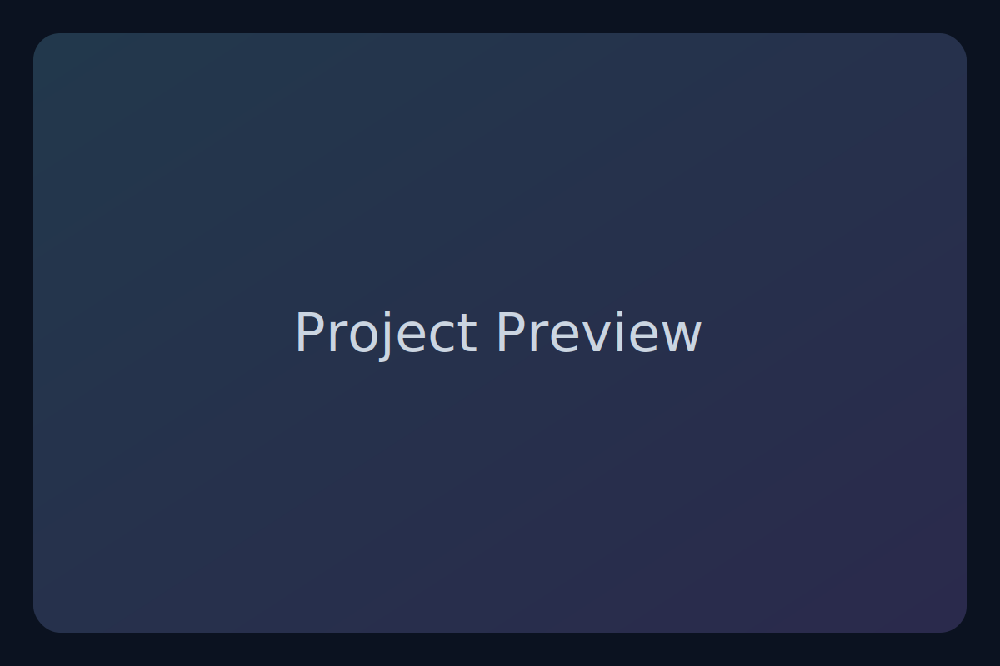

# Modern PHP Portfolio

A clean, modern, **no-framework** PHP portfolio template.  
Built for developers who want a fast, maintainable personal site with a great UX, **light/dark theme**, and a secure contact form — without pulling in heavy dependencies.

<p align="left">
  = 8.0" src="https://img.shields.io/badge/PHP-%3E%3D%208.0-777BB4.svg?logo=php&logoColor=white">
  
  
  
</p>

---

## Preview
> Replace these with real screenshots of your site.
<p align="center">
  
</p>

---

## Table of Contents
- [Features](#features)
- [Project Structure](#project-structure)
- [Quick Start](#quick-start)
- [Configuration](#configuration)
- [Pages & Routing](#pages--routing)
- [Contact Form](#contact-form)
- [Customize the Design](#customize-the-design)
- [Deployment](#deployment)
- [Troubleshooting](#troubleshooting)
- [FAQ](#faq)
- [License](#license)

---

## Features
- ⚡️ **Lightweight:** vanilla PHP, zero external PHP dependencies
- 🌓 **Light/Dark theme:** toggle stored in `localStorage`
- 🧭 **Clean routing:** root-level `index.php` with `?page=home|projects|about|contact`
- 🧩 **Composable UI:** shared `header.php` and `footer.php`, one CSS file
- 🗂️ **Easy content:** edit a single `data/projects.php` array to manage projects
- 🛡️ **Secure contact form:** CSRF token + validation, saves to CSV, attempts `mail()`
- 🖼️ **Modern look:** cards, responsive grid, subtle gradients, accessible colors
- 🛠 **MIT licensed** — use it anywhere

---

## Project Structure
```
modern-php-portfolio/
├─ index.php            # Router
├─ header.php           # Shared header (nav + theme toggle)
├─ footer.php           # Shared footer (social links)
├─ config.php           # Site name, tagline, email, socials
├─ functions.php        # Helpers: config(), e(), CSRF, mail, etc.
├─ pages/
│  ├─ home.php
│  ├─ projects.php
│  ├─ about.php
│  └─ contact.php
├─ data/
│  └─ projects.php      # Your projects array
├─ assets/
│  ├─ css/style.css
│  ├─ js/main.js
│  └─ img/placeholder.svg
├─ storage/
│  └─ messages.csv      # Created after first form submit
├─ .htaccess            # (Optional) Pretty URLs via mod_rewrite
├─ .gitignore
├─ LICENSE
└─ README.md
```

---

## Quick Start

### 1) Clone & run locally
```bash
# PHP 8.0+ is recommended
php -S localhost:8000
```
Now open **http://localhost:8000**

### 2) Configure your site
- Update **`config.php`** (name, tagline, email, social links).
- Add projects in **`data/projects.php`**.

### 3) Deploy
- Upload the folder to any PHP host (cPanel, Plesk, VPS with Apache/Nginx).
- Make sure the **document root** points to this repository root (where `index.php` lives).

> **Heads up:** GitHub Pages doesn’t run PHP. Use a PHP-capable host.

---

## Configuration

Open **`config.php`** and change these to your details:

```php
return [
  'site_name' => 'Harsh Gupta',
  'tagline'   => 'PHP / WordPress Developer — Clean, secure, scalable.',
  'owner'     => 'Harsh Gupta',
  'contact_email' => 'hello@harshgupta.me',
  'socials' => [
    'github'      => 'https://github.com/gupta-8',
    'x'           => 'https://x.com/harshguptame',
    'site'        => 'https://harshgupta.me',
    'huggingface' => 'https://huggingface.co/harshguptame'
  ],
];
```

### Add Projects
Edit **`data/projects.php`** — it’s one array:

```php
$projects = [
  [
    'title' => 'WP Speed Kit',
    'description' => 'A WordPress performance toolkit that improves Core Web Vitals.',
    'tech' => ['PHP','WordPress','MySQL'],
    'image' => 'assets/img/placeholder.svg',
    'live'  => '',
    'source'=> 'https://github.com/gupta-8',
    'featured' => true
  ],
  // more...
];
```

---

## Pages & Routing
- Router lives in **`index.php`** and whitelists pages:
  ```php
  $allowed = ['home','projects','about','contact'];
  ```
- Add a new page:
  1. Create `pages/services.php`
  2. Add `'services'` to `$allowed`
  3. (Optional) Enable pretty URL via `.htaccess`:
     ```apache
     RewriteRule ^(home|projects|about|contact|services)/?$ index.php?page=$1 [L,QSA]
     ```

---

## Contact Form

- Form is on **`pages/contact.php`**
- **Security:** CSRF token + server-side validation
- **Delivery:** Saves every message to `storage/messages.csv`; also tries `mail()`
- **Where are messages?** After the first submission, the CSV file appears here:
  ```
  storage/messages.csv
  ```

> If `mail()` isn’t configured on your host, you’ll still have the CSV log.  
> For email delivery, configure your host’s mail settings or use SMTP (e.g., via sendmail/PHPMailer in a future enhancement).

---

## Customize the Design

Most styling lives in **`assets/css/style.css`**. Tweak the theme via CSS variables:

```css
:root{
  --bg:#0b1220; --bg-2:#0e1528; --panel:#131c31; --border:#1f2a44; --text:#e6edf7; --muted:#9fb0c6;
  --brand:#7dd3fc; --brand-2:#a78bfa; --accent:#22d3ee; --success:#10b981; --danger:#ef4444;
  --radius:18px; --gap:1rem; --maxw:1100px;
}
/* Light theme overrides */
:root.light{--bg:#f6f7fb; --bg-2:#ffffff; --panel:#ffffff; --border:#e5e7eb; --text:#0f172a; --muted:#5b6b82}
```

**Theme toggle** logic is in **`assets/js/main.js`** and persists using `localStorage`.

---

## Deployment

### cPanel (shared hosting)
1. Create a domain/subdomain (e.g., `portfolio.example.com`).
2. Set document root to the repo folder (contains `index.php`).
3. Upload the files or connect Git from your repo.
4. Ensure PHP **8.0+** is active (Select PHP Version in cPanel).

### Apache (VPS)
- Place the project at `/var/www/modern-php-portfolio`
- Optional **.htaccess** provided for pretty URLs (requires `mod_rewrite`).

### Nginx (VPS)
Add a server block:
```nginx
server {
  listen 80;
  server_name example.com;
  root /var/www/modern-php-portfolio;
  index index.php;

  location / {
    try_files $uri $uri/ /index.php?$query_string;
  }

  location ~ \.php$ {
    include snippets/fastcgi-php.conf;
    fastcgi_pass unix:/run/php/php8.2-fpm.sock; # adjust version/socket
  }
}
```

---

## Troubleshooting

- **CSS/JS not loading** → Check paths. On subfolders, use `./assets/...` (already used in this template).
- **404 on pretty URLs** → Enable `mod_rewrite` (Apache) or use the Nginx config above.
- **Contact form not emailing** → Your host may block `mail()`. CSV logging still works. Configure SMTP/PHPMailer if needed.
- **`storage/messages.csv` missing** → It appears after the first form submission.
- **Permissions** → Ensure the server can write to `/storage` (e.g., `chmod 755` or `775` on Linux).

---

## FAQ

**Q: Can I host this on GitHub Pages?**  
A: No — GitHub Pages is static only. Use a PHP-capable host.

**Q: How do I add another page?**  
A: Create `pages/yourpage.php` and add `'yourpage'` to `$allowed` in `index.php` (and `.htaccess` if you use pretty URLs).

**Q: Can I change colors and fonts?**  
A: Yep. Edit CSS variables in `assets/css/style.css`. The font is loaded via Google Fonts in `header.php` — swap it if you prefer.

**Q: Where do I add my social links?**  
A: In `config.php` under the `socials` array.

---

## License
This project is released under the **MIT License**. See [LICENSE](LICENSE) for details.

---

### Credits
Made with ❤️ by **Harsh Gupta**.  
- Website: https://harshgupta.me  
- GitHub: https://github.com/gupta-8  
- X: https://x.com/harshguptame
